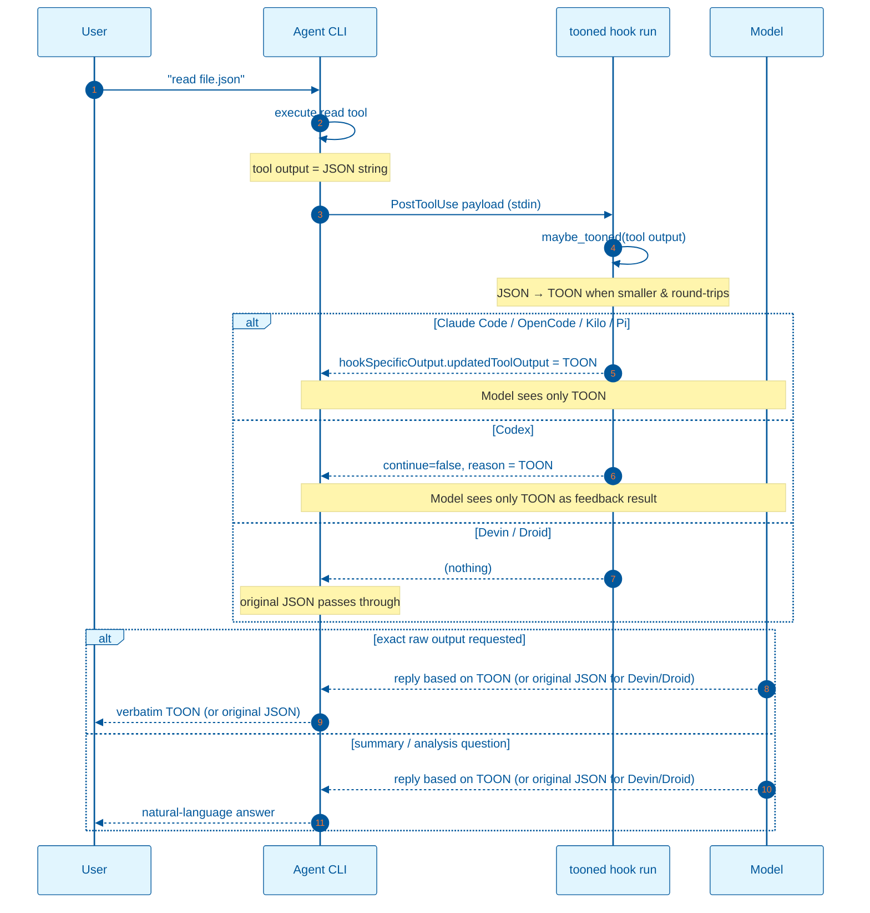
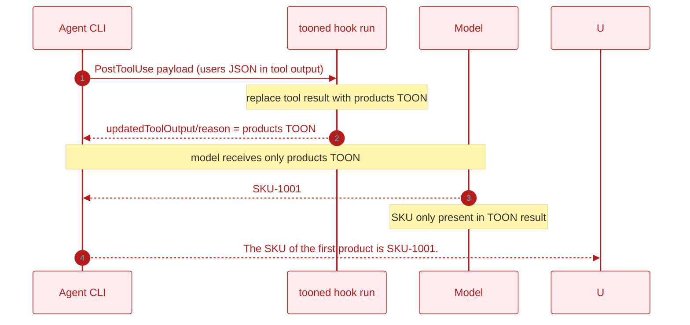

# TOON Context Hook — Backend Flow and Model Comprehension Proof

This document describes how `tooned` fits into an agent's hook pipeline and the mismatch test that shows the model can read the TOON it produces.

## Backend flow



### What the backend does

1. The agent calls a tool (`read`, `exec`, `grep`, `glob`, an MCP tool, etc.).
2. The agent wraps the result in a `PostToolUse` payload and pipes it to `tooned hook run`.
3. `tooned` parses the tool output, detects its shape, and tries to produce a smaller TOON encoding.
4. If TOON is smaller and round-trips, `tooned` prints a protocol-specific JSON object:

   - **Claude Code, OpenCode, Kilo, Pi:**
     ```json
     {
       "hookSpecificOutput": {
         "hookEventName": "PostToolUse",
         "updatedToolOutput": "[20]{id,name,email,active,role}:\n  1,user_1,..."
       }
     }
     ```
   - **Codex:**
     ```json
     {
       "continue": false,
       "reason": "[20]{id,name,email,active,role}:\n  1,user_1,...",
       "hookSpecificOutput": {
         "hookEventName": "PostToolUse"
       }
     }
     ```
     Codex treats `continue: false` + `reason` as PostToolUse feedback and surfaces the `reason` text as the model-visible tool result.
   - **Devin, Droid:** `tooned` prints nothing. These agents only support `additionalContext` in `PostToolUse`, which would keep the original JSON and append the TOON, inflating total token count. Use `tooned wrap -- <cmd>` or `... | tooned pipe` with those agents to deliver TOON-only output.

5. The agent forwards the result to the model. With replacement protocols the model sees only the TOON. With Devin/Droid the model sees the original JSON unless the command itself was wrapped.

The exact field name for the tool output depends on the agent. The hook reads it from the field the agent provides, whether that is a top-level string, an object, or a nested `output` key.

### What the user / agent sees

- **Claude Code / OpenCode / Kilo / Pi:** the tool result is replaced with TOON via `updatedToolOutput`. Exact-content prompts return the TOON text.
- **Codex:** the tool result is replaced with the TOON `reason` feedback. Exact-content prompts return the TOON text.
- **Devin / Droid:** the `PostToolUse` hook does not modify the tool result. Exact-content prompts return the original JSON. To get TOON output, wrap the command with `tooned`.

## Proof that the model reads TOON

To isolate the model's reliance on the TOON result, a mismatch experiment was run.

### Setup

| File | Original tool output | Replaced tool result |
|---|---|---|
| `agent-test/users_20.json` | JSON array of 20 user objects | TOON encoding of `agent-test/products_20.json` |

The `users` file has `id`, `name`, `email`, `active`, `role`. The `products` file has `sku`, `name`, `price`, `qty`, `category`.

### Prompt

```text
read the file users_20.json and tell me the SKU of the first product
```

### Result

> The SKU of the first product is `SKU-1001`.

### Why this is strong evidence

The original tool output (`users_20.json`) contains no `sku` field. The only place `SKU-1001` exists is inside the TOON result, which was the TOON encoding of `products_20.json`. Because the model produced `SKU-1001`, it read and understood the TOON result.



### Observed transcript

The exchange below is the actual live test, with only the agent and local path names generalized:

- **Baseline prompt:** `read agent-test/users_20.json`
- **Baseline response:** "Done. I read `agent-test/users_20.json` — it's a JSON array of 20 user objects with `id`, `name`, `email`, `active`, and `role` fields." (response driven by the users TOON result)
- **Mismatch prompt:** `read the file users_20.json and tell me the SKU of the first product`
- **Mismatch response:** `The SKU of the first product is SKU-1001.`

### Reasoning chain

1. The baseline summary could come from either the original JSON or a TOON result containing the same user records. It only confirms the conversion pipeline ran and the model received coherent structured data.
2. The mismatch prompt asks for `sku`, which the original `users_20.json` does not contain. The only source of `SKU-1001` is the TOON result (the TOON of `products_20.json`).
3. Therefore the model parsed the TOON result: it identified the header `products[20]{sku,name,price,qty,category}:`, understood the first column is `sku`, took the first row, and returned `SKU-1001`. This is not a surface string match; it requires mapping header/row structure to the question.
4. With replacement protocols, exact-output requests return the TOON text, confirming the original JSON is not in that context item.

### External validation

The finding is consistent with recent arXiv literature on alternative serializations for LLMs:

- **McMillan, 2026** — *Structured Context Engineering for File-Native Agentic Systems* (arXiv:2602.05447v2) reports 9,649 experiments across 11 models and four formats (JSON, YAML, Markdown, TOON). The main result: "format does not significantly affect aggregate accuracy (chi-squared=2.45, p=0.484), though individual models, particularly open source, exhibit format-specific sensitivities." This supports the observation that the model's comprehension does not depend on the original JSON syntax being intact.
- **Kutschka & Geiger, 2026** — *Notation Matters: A Benchmark Study of Token-Optimized Formats in Agentic AI Systems* (arXiv:2605.29676v2) evaluates TOON and TRON inside end-to-end agentic loops, decoupling input compression (comprehension) from output compression (generation). They report token reductions of up to 18% for TOON with accuracy within 9 percentage points of JSON.
- **Matveev, 2026** — *Token-Oriented Object Notation vs JSON: A Benchmark of Plain and Constrained Decoding Generation* (arXiv:2603.03306v1) states that TOON "aims to replace JSON as a serialization format designed for passing structured data to Large Language Models" and notes "solid accuracy in LLM comprehension."
- **Dong et al., 2024** — *SpreadsheetLLM: Encoding Spreadsheets for Large Language Models* (arXiv:2407.09025v2) shows that a compressed, structure-aware encoding of spreadsheets improves GPT-4 in-context learning by 25.6% and reaches 78.9% F1, demonstrating that LLMs can reason over heavily compressed tabular data when logical structure is preserved.

### Is this a novel finding?

LLMs can already answer structured questions from a losslessly compressed, tabular encoding of the same data, and that is no longer surprising. The TOON format itself and several independent benchmarks show that models parse header/row-style formats without needing the original JSON syntax. `tooned`'s contribution is the mechanism and the test: a `PostToolUse` hook that replaces the native tool result with a smaller TOON encoding where the protocol supports it, and a mismatch experiment that isolates the model's reliance on that TOON result.

## Implications

- The model does not need raw JSON in context to answer structured questions.
- TOON reduces context size for convertible payloads when the agent protocol replaces the native tool result with TOON.
- For exact-raw-output requests with replacement protocols, the model returns the TOON text (the original JSON is not preserved in that context item).
- For agents that only support `additionalContext` in `PostToolUse` (Devin, Droid), the `tooned` hook passes through. Use command-level wrapping (`tooned wrap -- <cmd>` or `... | tooned pipe`) to deliver TOON-only output with those agents.
- The hook command is configured with a short timeout so a stalled `tooned` process cannot hang the agent's tool-call pipeline.
