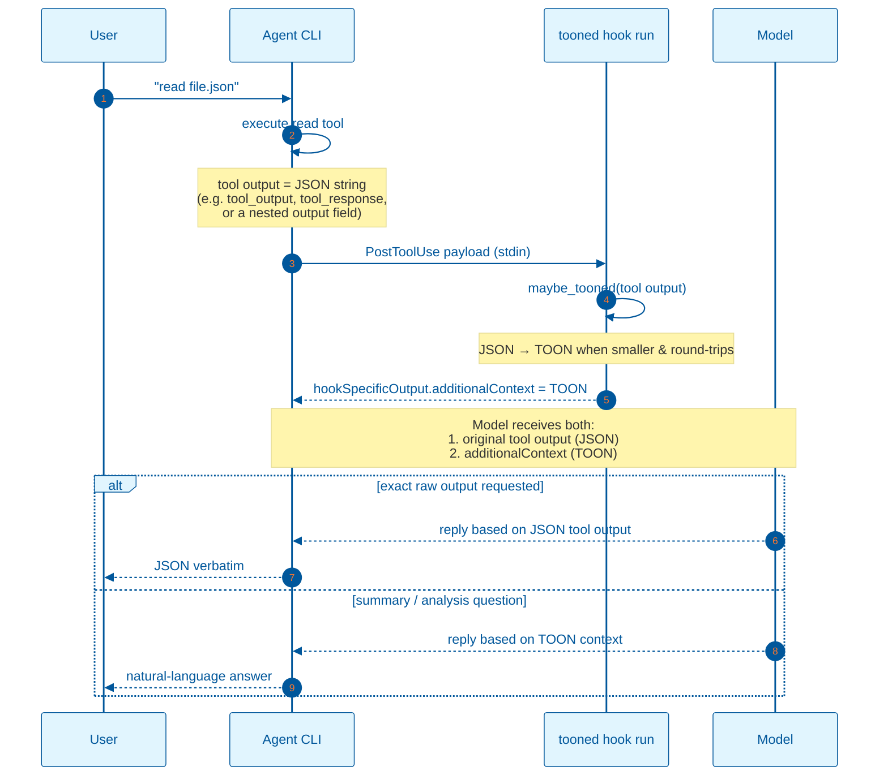
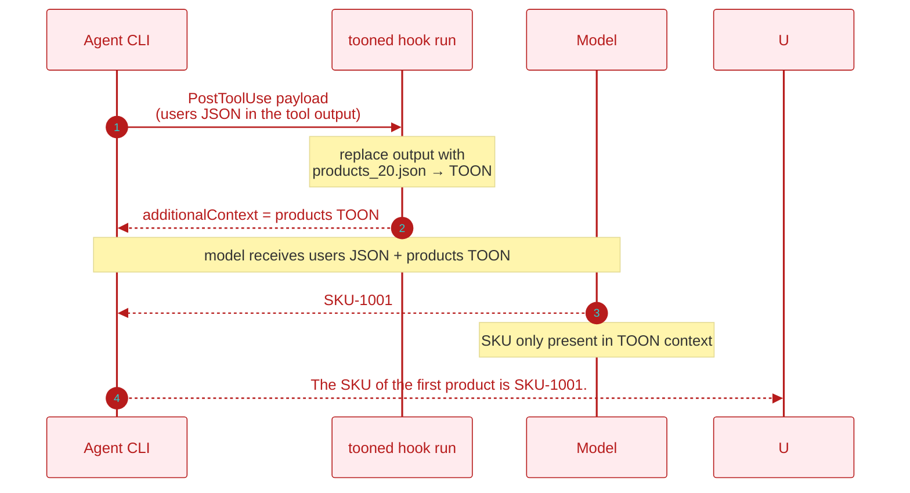

# TOON Context Hook — Backend Flow and Model Comprehension Proof

This document describes how `tooned` fits into an agent's `PostToolUse` hook
pipeline, what each layer sees, and the test that proves the underlying model
can read and reason over the TOON representation it injects.

## Backend flow



### What the backend does

1. The agent calls a tool (`read`, `exec`, `grep`, `glob`, an MCP tool, etc.).
2. The agent wraps the result in a `PostToolUse` payload and pipes it to
   `tooned hook run`.
3. `tooned` parses the tool's raw output, detects its shape, and tries to
   produce a smaller TOON encoding.
4. If TOON is smaller and round-trips correctly, `tooned` prints a JSON object:
   ```json
   {
     "hookSpecificOutput": {
       "hookEventName": "PostToolUse",
       "additionalContext": "[20]{id,name,email,active,role}:\n  1,user_1,..."
     }
   }
   ```
   Otherwise it prints nothing, and the original tool output passes through
   unchanged.
5. The agent forwards both the original tool output and the `additionalContext`
   to the model.

The exact field name in the `PostToolUse` payload depends on the agent. The hook
implementation reads the tool output from the field the agent provides, whether
that is a top-level string, an object, or a nested `output` key.

### What the user / agent sees

- **Exact-content prompts** ("print the file unchanged"): the model typically
  uses the original tool output, so the user gets the raw JSON.
- **Analysis / extraction prompts** ("how many active users?", "what is the SKU
  of the first product?"): the model can answer from the TOON `additionalContext`
  just as accurately as from the JSON, because the data is identical — only the
  token count changes.

## Proof that the model reads TOON

To prove the model actually consumes the TOON `additionalContext` and not just
the original JSON, a mismatch experiment was run.

### Setup

| File | Original tool output | Injected `additionalContext` |
|---|---|---|
| `agent-test/users_20.json` | JSON array of 20 user objects | TOON encoding of `agent-test/products_20.json` |

The `users` file has fields `id`, `name`, `email`, `active`, and `role`. The
`products` file has fields `sku`, `name`, `price`, `qty`, and `category`.

### Prompt

```
read the file users_20.json and tell me the SKU of the first product
```

### Result

> The SKU of the first product is `SKU-1001`.

### Why this proves it

The original tool output (`users_20.json`) contains **no `sku` field**. The
only place `SKU-1001` exists is inside the TOON `additionalContext`, which was
the TOON encoding of the `products` file. Because the model produced the correct
SKU, it must have read and understood the TOON context.



### Observed transcript

The transcript below is the actual live test, with only the agent name and
local fixture path generalized:

- **Baseline prompt:** `read agent-test/users_20.json`
- **Baseline response:** "Done. I read `agent-test/users_20.json` — it's a JSON
  array of 20 user objects with `id`, `name`, `email`, `active`, and `role`
  fields."
- **Mismatch prompt:** `read the file users_20.json and tell me the SKU of the
  first product`
- **Mismatch response:** `The SKU of the first product is SKU-1001.`

### Reasoning chain

1. **Baseline response is ambiguous on its own.** The user asked for a summary
   of a users file. Both the original JSON tool output and the injected TOON
   `additionalContext` contain the same 20 user records, so a correct summary
   could come from either source. This only confirms the hook fired and the
   model received coherent structured data.
2. **Mismatch response is decisive.** The prompt explicitly asks for the
   `sku` of the first product. The original `users_20.json` output has no `sku`
   field at all. The only source that contains `SKU-1001` is the TOON
   `additionalContext`, which was the TOON encoding of `products_20.json`.
3. **Therefore the model parsed the TOON context.** It identified the header
   `products[20]{sku,name,price,qty,category}:`, understood that the first
   column is `sku`, took the first row, and returned `SKU-1001`. This is not a
   surface string match; it requires mapping the header/row structure to the
   question's requested field and index.
4. **Original JSON is still available for exact-copy tasks.** When a later
   prompt asked to "print the file unchanged," the model emitted the raw JSON
   from the original tool output rather than the TOON context. Both contexts
   coexist; the model can use whichever is appropriate for the prompt.

### External validation

The finding is consistent with recent arXiv literature on alternative
serializations for LLMs:

- **McMillan, 2026** — *Structured Context Engineering for File-Native Agentic
  Systems* (arXiv:2602.05447v2) reports 9,649 experiments across 11 models and
  four formats (JSON, YAML, Markdown, TOON). The main result: "format does not
  significantly affect aggregate accuracy (chi-squared=2.45, p=0.484), though
  individual models, particularly open source, exhibit format-specific
  sensitivities." This directly supports the observation that the model's
  comprehension does not depend on the original JSON syntax being intact.
- **Kutschka & Geiger, 2026** — *Notation Matters: A Benchmark Study of
  Token-Optimized Formats in Agentic AI Systems* (arXiv:2605.29676v2)
  evaluates TOON and TRON inside end-to-end agentic loops, decoupling input
  compression (comprehension) from output compression (generation). They report
  token reductions of up to 18% for TOON with accuracy within 9 percentage
  points of JSON, and note that prior work found "LLMs can read TOON with
  minimal accuracy loss on isolated generation tasks." The paper also shows
  that the largest token savings accrue on tool schemas and tool results — the
  exact point where `tooned` injects TOON.
- **Matveev, 2026** — *Token-Oriented Object Notation vs JSON: A Benchmark of
  Plain and Constrained Decoding Generation* (arXiv:2603.03306v1) states that
  TOON "aims to replace JSON as a serialization format designed for passing
  structured data to Large Language Models" and refers to "solid accuracy in
  LLM comprehension."
- **SpreadsheetLLM** (Dong et al., 2024, arXiv:2407.09025v2) shows that a
  compressed, structure-aware encoding of spreadsheets (SheetCompressor)
  improves GPT-4's in-context learning by 25.6% and reaches 78.9% F1, which
  demonstrates that LLMs can reason over heavily compressed tabular data as
  long as the compression preserves the logical structure.

### Is this a novel finding?

The underlying capability — LLMs can answer structured questions from a
losslessly compressed, tabular encoding of the same data — is no longer
surprising. The TOON format itself, and several independent benchmarks, already
show that models parse header/row-style formats without needing the original
JSON syntax. What is specific to `tooned` is the **mechanism and proof**: a
transparent `PostToolUse` hook that leaves the original tool output intact,
injecting a smaller TOON view as `additionalContext`, and a mismatch experiment
that isolates the model's reliance on that TOON view. The model is not
"knowing it is JSON"; it is reasoning over the same JSON data model, encoded
more compactly. TOON is a lossless representation of JSON, so the semantics are
identical — only the token surface changes.

## Implications

- The model does **not** require raw JSON in context to answer structured
  questions.
- TOON reduces context size for convertible payloads while preserving the
  model's ability to reason about the data.
- For exact-raw-output requests, the original tool output remains available, so
  fidelity is not compromised.
- The hook command is configured with a 5-second timeout so a stalled `tooned`
  process cannot hang the agent's tool-call pipeline.
