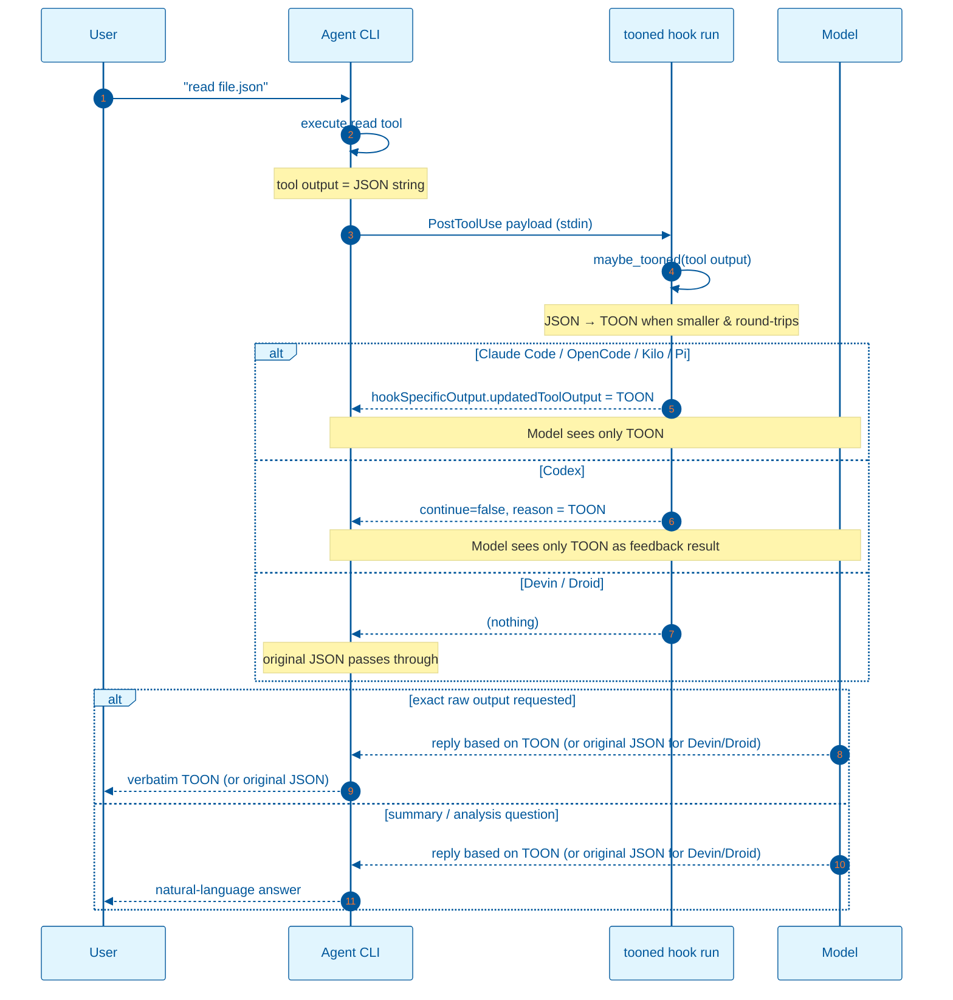

# TOON Context Hook — Backend Flow

`tooned hook run` runs after a tool call and tries to rewrite the output into a smaller TOON encoding. For agents that support tool result replacement (Claude Code, OpenCode, Kilo, Pi with `updatedToolOutput`, Codex with `continue: false` + `reason`), the model receives only the TOON. For Devin/Droid, which do not support replacement in `PostToolUse`, the hook passes through; use `tooned wrap -- <cmd>` or `... | tooned pipe` for TOON-only output.



## What the backend does

1. The agent calls a tool (`read`, `exec`, `grep`, `glob`, an MCP tool, etc.).
2. The agent wraps the result in a `PostToolUse` payload and pipes it to `tooned hook run`.
3. `tooned` detects the format, parses it, and tries to produce a smaller TOON encoding.
4. If TOON is smaller and round-trips, `tooned` prints a protocol-specific JSON object:

   - **Claude Code, OpenCode, Kilo, Pi:**

     ```json
     {
       "hookSpecificOutput": {
         "hookEventName": "PostToolUse",
         "updatedToolOutput": "[20]{id,name,email,active,role}:\n  1,user_1,..."
       }
     }
     ```

   - **Codex:**

     ```json
     {
       "continue": false,
       "reason": "[20]{id,name,email,active,role}:\n  1,user_1,...",
       "hookSpecificOutput": {
         "hookEventName": "PostToolUse"
       }
     }
     ```

     Codex treats `continue: false` + `reason` as PostToolUse feedback and surfaces the `reason` text as the model-visible tool result.
   - **Devin, Droid:** `tooned` prints nothing. These agents only support `additionalContext` in `PostToolUse`, which would keep the original JSON and append the TOON, inflating total token count. Use `tooned wrap -- <cmd>` or `... | tooned pipe` with those agents to deliver TOON-only output.

5. The agent forwards the result to the model. With replacement protocols the model sees only the TOON. With Devin/Droid the model sees the original JSON unless the command itself was wrapped.

The exact field name for the tool output depends on the agent; the hook reads whatever field the agent provides.

## What the user sees

- **Claude Code / OpenCode / Kilo / Pi:** the tool result is replaced with TOON via `updatedToolOutput`. Exact-content prompts return the TOON text.
- **Codex:** the tool result is replaced with the TOON `reason` feedback. Exact-content prompts return the TOON text.
- **Devin / Droid:** the `PostToolUse` hook does not modify the tool result. Exact-content prompts return the original JSON. To get TOON output, wrap the command with `tooned`.

## Proof the model reads the TOON

A mismatch experiment is described in [`toon-evidence.md`](toon-evidence.md): the hook injected the TOON of `products_20.json` while the agent read `users_20.json`, which contains no `sku` field. The prompt asked for the SKU of the first product and the model answered `SKU-1001`, a value that only existed in the injected TOON context.

## Protocol differences

See [`toon-hook-flow.md`](toon-hook-flow.md) for the per-agent protocol mapping.
