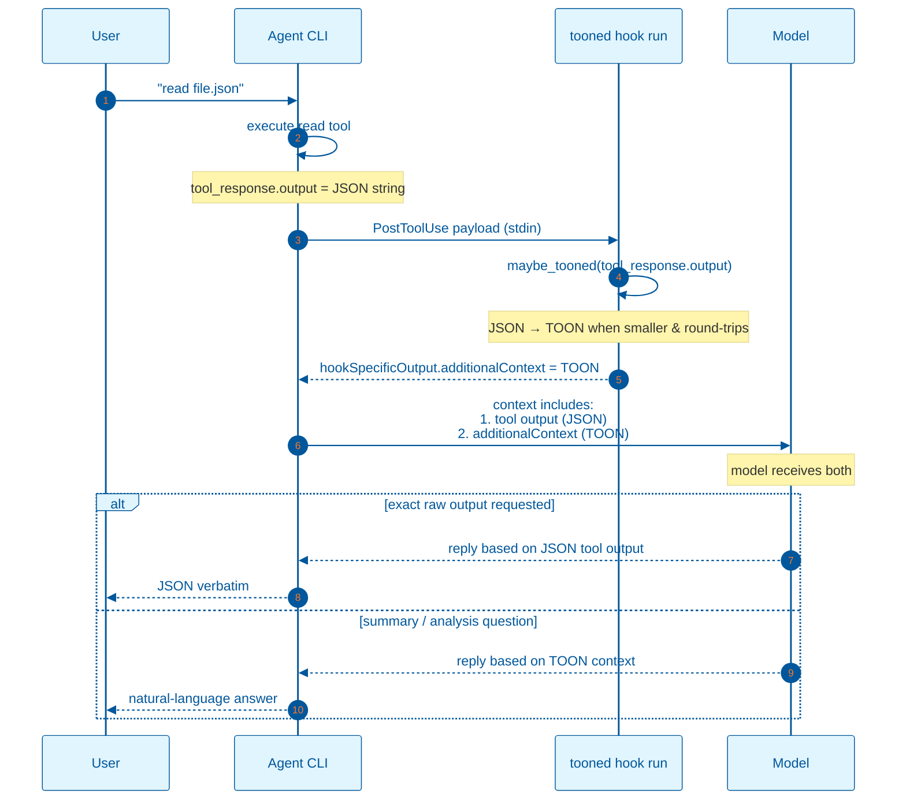
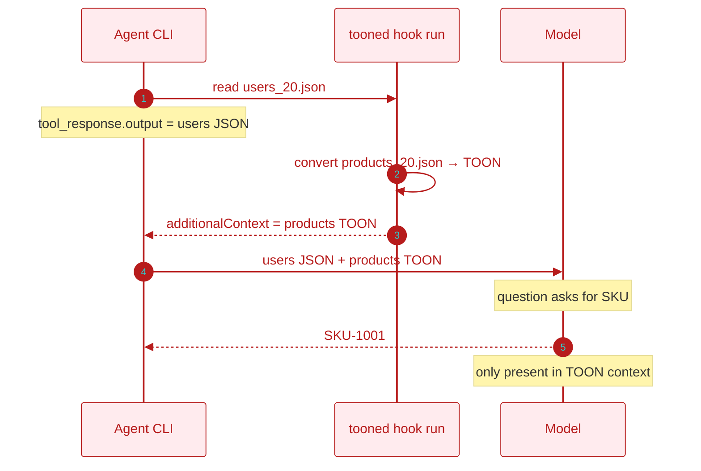

# TOON Context Hook — Backend Flow and Model Comprehension Proof

This document describes how `tooned` fits into an agent's `PostToolUse` hook
pipeline, what each layer sees, and the test that proves the underlying model
can read and reason over the TOON representation it injects.

## Backend flow



### What the backend does

1. The agent calls a tool (`read`, `exec`, `grep`, `glob`, an MCP tool, etc.).
2. The agent wraps the result in a `PostToolUse` payload and pipes it to
   `tooned hook run`.
3. `tooned` parses the tool's raw output, detects its shape, and tries to
   produce a smaller TOON encoding.
4. If TOON is smaller and round-trips correctly, `tooned` prints a JSON object:
   ```json
   {
     "hookSpecificOutput": {
       "hookEventName": "PostToolUse",
       "additionalContext": "[20]{id,name,email,active,role}:\n  1,user_1,..."
     }
   }
   ```
   Otherwise it prints nothing, and the original tool output passes through
   unchanged.
5. The agent forwards both the original tool output and the `additionalContext`
   to the model.

### What the user / agent sees

- **Exact-content prompts** ("print the file unchanged"): the model typically
  uses the original tool output, so the user gets the raw JSON.
- **Analysis / extraction prompts** ("how many active users?", "what is the SKU
  of the first product?"): the model can answer from the TOON `additionalContext`
  just as accurately as from the JSON, because the data is identical — only the
  token count changes.

## Proof that the model reads TOON

To prove the model actually consumes the TOON `additionalContext` and not just
the original JSON, a mismatch experiment was run.

### Setup

| File | Original tool output | Injected `additionalContext` |
|---|---|---|
| `devin-test/users_20.json` | JSON array of 20 user objects | TOON encoding of `devin-test/products_20.json` |

The `users` file has fields `id`, `name`, `email`, `active`, and `role`. The
`products` file has fields `sku`, `name`, `price`, `qty`, and `category`.

### Prompt

```
read the file users_20.json and tell me the SKU of the first product
```

### Result

> The SKU of the first product is `SKU-1001`.

### Why this proves it

The original tool output (`users_20.json`) contains **no `sku` field**. The
only place `SKU-1001` exists is inside the TOON `additionalContext`, which was
the TOON encoding of the `products` file. Because the model produced the correct
SKU, it must have read and understood the TOON context.



## Implications

- The model does **not** require raw JSON in context to answer structured
  questions.
- TOON reduces context size for convertible payloads while preserving the
  model's ability to reason about the data.
- For exact-raw-output requests, the original tool output remains available, so
  fidelity is not compromised.
