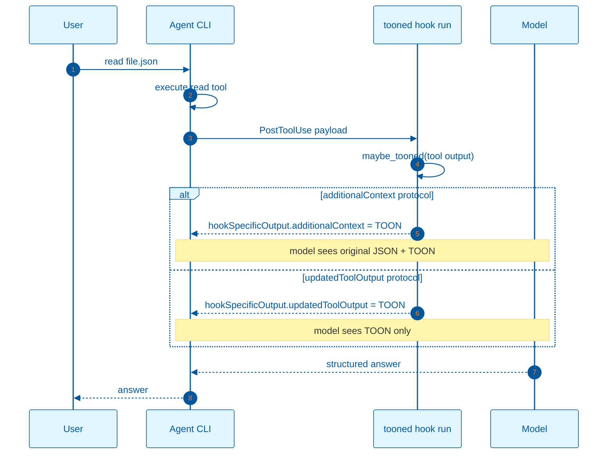

# TOON hook flow by agent protocol

`tooned hook run` is invoked as a `PostToolUse` command by the agent CLI. The payload shape and the way the TOON is returned depend on the agent protocol.

## Protocol mapping

| Agent family | Tool output field | TOON surfaced as | Original tool output |
|---|---|---|---|
| Codex, Devin, Droid | `tool_response` / `toolOutput` | `hookSpecificOutput.additionalContext` | preserved |
| Claude Code, OpenCode, Kilo, Pi | `tool_output` | `hookSpecificOutput.updatedToolOutput` | replaced by TOON |

## Flow

## What the user sees

- `additionalContext` protocols: exact-output prompts return the original JSON; analysis prompts can use either the original JSON or the TOON context.
- `updatedToolOutput` protocols: the model sees only the TOON for that tool call. Exact-output prompts will return the TOON or a summary of it; the original raw JSON is no longer in that context item. Fidelity for exact copies is therefore a protocol-level concern, not a `tooned` concern.

For the proof that the model can read the TOON context, see [`toon-context-proof.md`](toon-context-proof.md). For cross-format decoding, see [`toon-decoding.md`](toon-decoding.md).
