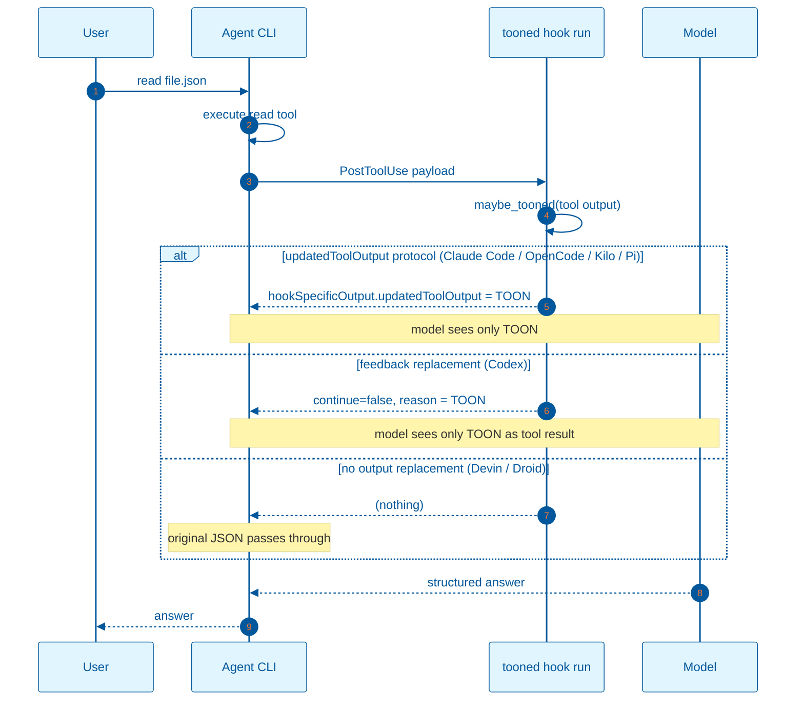

# TOON hook flow by agent protocol

`tooned hook run` runs as a `PostToolUse` command. The payload shape and the way the TOON is returned depend on the agent protocol.

| Agent family | Tool output field | TOON surfaced as | Original tool output |
|---|---|---|---|
| Claude Code, OpenCode, Kilo, Pi | `tool_output` | `hookSpecificOutput.updatedToolOutput` | replaced by TOON |
| Codex | `tool_response` | top-level `continue: false` + `reason` feedback | replaced by TOON |
| Devin, Droid | `tool_response` / `toolOutput` | (none; hook passes through) | preserved |

For Devin and Droid, use command-level wrapping (`tooned wrap -- <cmd>` or `... | tooned pipe`) when TOON-only output is required.

- `updatedToolOutput` / feedback replacement protocols: the model sees only the TOON for that tool call. Exact-output prompts return the TOON or a summary of it; the original raw JSON is no longer in that context item. Fidelity for exact copies is therefore a protocol-level concern, not a `tooned` concern.

- Devin / Droid `PostToolUse` hooks: `tooned` prints nothing. The model sees the original JSON. To get TOON output, wrap the command with `tooned` so the tool output itself is TOON.

For the mismatch test that shows the model reads the TOON, see [`toon-evidence.md`](toon-evidence.md). For the backend flow, see [`toon-context-proof.md`](toon-context-proof.md).
