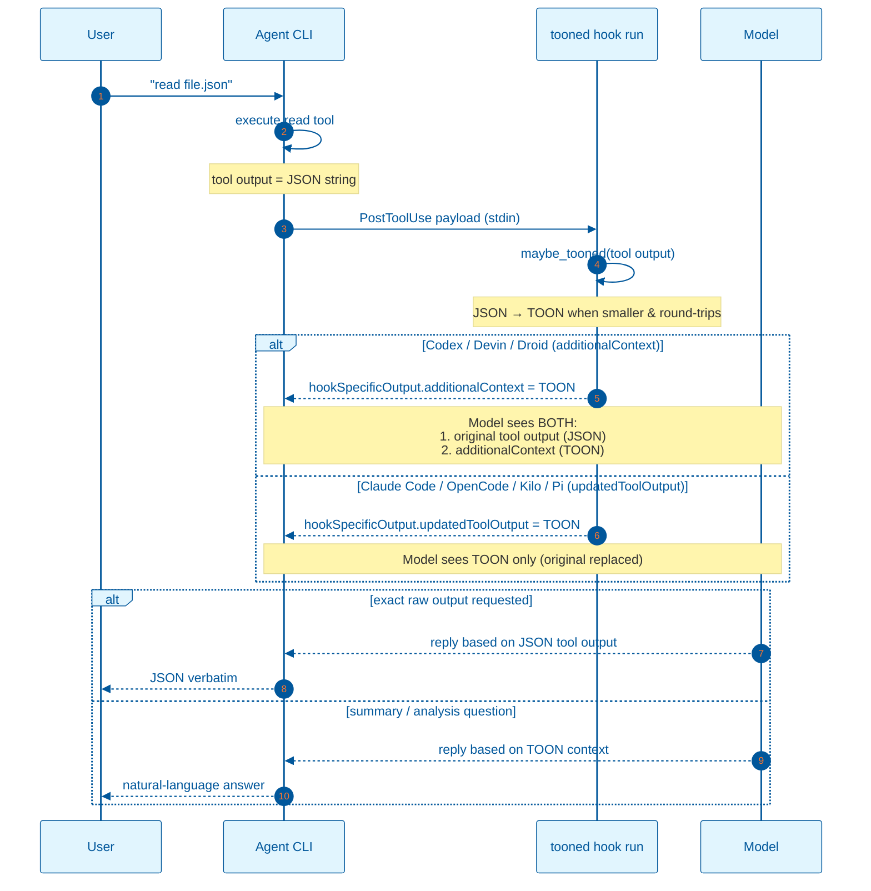
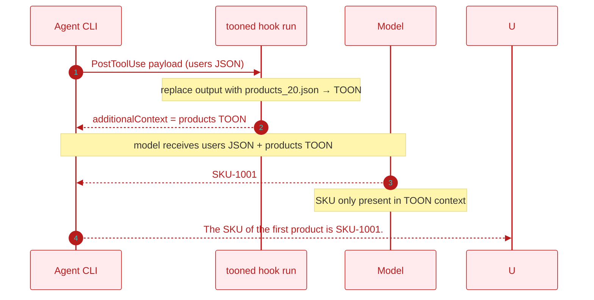

# TOON hook flow and the model reads it

How `tooned` fits into an agent's `PostToolUse` hook pipeline, what each layer
sees, and the test showing the model can read and reason over the TOON it
injects. (Findings + the model's own explanations are in
[`toon-evidence.md`](toon-evidence.md); cross-format tests + research in
[`toon-decoding.md`](toon-decoding.md).)

## Backend flow

`tooned` converts the tool's JSON output into a smaller TOON encoding and
surfaces it to the model. **How it is surfaced depends on the agent protocol:**

- **`additionalContext`** — the original tool output is preserved alongside
  TOON: Codex, Devin, Droid.
- **`updatedToolOutput`** — TOON *replaces* the tool output in place: Claude
  Code, OpenCode, Kilo, Pi.



### What the backend does

1. The agent calls a tool (`read`, `exec`, `grep`, `glob`, an MCP tool, etc.).
2. It wraps the result in a `PostToolUse` payload and pipes it to
   `tooned hook run`.
3. `tooned` parses the raw output, detects its shape, and tries to produce a
   smaller TOON encoding.
4. If TOON is smaller and round-trips, it prints the protocol-appropriate
   shape:

   ```json
   {
     "hookSpecificOutput": {
       "hookEventName": "PostToolUse",
       "additionalContext": "[20]{id,name,email,active,role}:\n  1,user_1,..."
     }
   }
   ```

   (For Claude Code/OpenCode/Kilo/Pi the same TOON text is emitted under
   `updatedToolOutput` instead.) Otherwise it prints nothing and the original
   output passes through unchanged.
5. The agent forwards the result to the model — either alongside the TOON
   (`additionalContext`) or as the replaced output (`updatedToolOutput`).

The payload field name for the tool output varies by agent; the hook reads it
wherever the agent puts it (top-level string, object, or nested `output` key).

### What the user / agent sees

- **Exact-content prompts** ("print the file unchanged"): under the
  `additionalContext` protocols the model can still use the original tool
  output, so the user gets the raw JSON. Under `updatedToolOutput` protocols
  the original is replaced, so the user sees the TOON (or the model's summary
  of it).
- **Analysis / extraction prompts** ("how many active users?", "what is the
  SKU of the first product?"): the model can answer from the TOON as accurately
  as from the JSON — only the token count changes.

## Test: the model reads TOON (mismatch test)

Evidence below uses the **Devin** protocol (`additionalContext`, original
preserved).

| File | Original tool output | Injected `additionalContext` |
|---|---|---|
| `users_20.json` | JSON array of 20 user objects | TOON of `products_20.json` |

The `users` file has `id`, `name`, `email`, `active`, `role`. The `products`
file has `sku`, `name`, `price`, `qty`, `category`.

**Prompt:** `read the file users_20.json and tell me the SKU of the first product`

> The SKU of the first product is `SKU-1001`.

`users_20.json` has **no `sku` field**. The only source of `SKU-1001` is the
TOON `additionalContext` (the TOON of `products_20.json`), so the model must
have read and understood the TOON context.



### Why this supports the claim

1. The baseline `read users_20.json` summary is ambiguous — both the JSON
   output and the TOON context contain the same 20 records, so either could
   source it. It only confirms the hook fired.
2. The mismatch prompt asks for a `sku` the original file lacks. The only
   source with `SKU-1001` is the TOON context.
3. Therefore the model parsed the TOON: it mapped the header
   `{sku,name,price,qty,category}` to a schema, took row 1, and returned the
   `sku` value. Not a bare string match — a structural read.
4. Exact-copy prompts still return the raw JSON from the original output (under
   `additionalContext` protocols). Both contexts coexist; the model uses
   whichever fits the prompt.

This is **supporting evidence**, not a formal proof: the test shows `SKU-1001`
was available only in the injected TOON and the model returned it, but it does
not by itself establish structural decoding, causal use of that
representation, or rule out the model locating the literal value. Stronger
controls (derived multi-field computations, randomized values, repeated trials,
captured raw outputs) would be needed to claim proof.

### Implications (scoped to the tested configuration)

- The model does not need raw JSON in context to answer structured questions.
- TOON shrinks context for convertible payloads while preserving the model's
  ability to reason about the data, in the runs observed here.
- For exact-raw-output requests, the original tool output stays available under
  the `additionalContext` protocols, so fidelity is uncompromised there.
- The hook runs with a short timeout so a stalled `tooned` can't hang the
  agent's tool-call pipeline.

### Is this novel?

No — LLMs reading losslessly compressed, tabular encodings is well documented
(see [`toon-decoding.md`](toon-decoding.md) for the arXiv citations). `tooned`'s
contribution is the mechanism and the test: a `PostToolUse` hook that surfaces
TOON to the model, plus a mismatch experiment that isolates the model's
reliance on that TOON view. The model never needs to know the data was JSON.
TOON is a lossless JSON representation, so the semantics are identical — only
the token surface changes.
